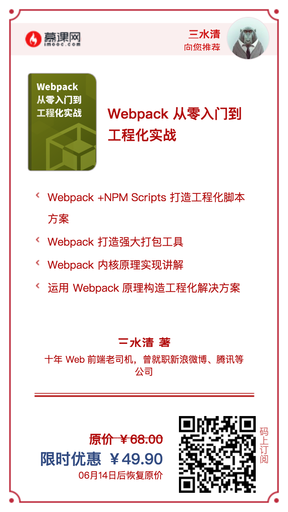

# 《Webpack 从零入门到工程化实战》专栏源码

本代码是慕课专栏《[Webpack 从零入门到工程化实战](https://s.imooc.com/WFtUMW5)》的源码。

## 专栏购买地址

## 说明

在[./packages](./packages)文件夹中，按照章节进行划分，进入对应章节的对应小节目录后，执行`npm install` 然后参考小节内容进行练习。

> 特别说明：
>
> 1. 有一些小节内容比较简单，不足够支撑一个练习项目，所以没有放进本项目中，可以按照小节操作内容，自己新建项目练手；
> 2. 如果用过[lerna](https://lernajs.io)和 yarn 的，可以使用`lerna bootstrap`开始项目。

### **专栏模块**

专栏共 37 讲，分为三大部分和六大模块。按照学习知识循序渐进和解决日常开发的环节来划分为三个大部分，分别为：Webpack 开发配置、Webpack 内核原理和工程化实践。

-   Webpack 开发配置：我会从基础概念、日常开发、上线优化三大模块来讲解；
-   Webpack 内核原理：学习 Webpack 的原理实现才能够让我们得心应手的使用它；
-   工程化实践：这个部分我会结合自己项目的实践，介绍一些基于 Webpack 打造的前端工程化解决方案。

下面是六大模块的详细课程介绍：

**入门篇**

介绍 Webpack 的基本概念和解决的问题，从零搭建 Webpack 构建环境，带领大家体验 Webpack-CLI 的零配置打包，介绍 Webpack 的核心概念和基础配置。

**配置篇**
从模块化开发、Babel、React/Vue 配置、TypeScript配置、CSS 样式相关配置和静态资源管理，到 Dev Server 环境配置，带领大家搭建基础开发环境。

**优化篇**
在优化篇，会针对生产环境的优化手段，从静态资源体积、缓存管理和 Webpack 打包速度优化进行深入讲解，并且对 Webpack 的代码拆分（SplitChunk）和 Tree-Shaking 代码级别的实践讲解。

**原理篇**
介绍 Webpack 的核心机制实现，学习 Webpack 的核心模块 Tapable 的实现和用法，更加深入的理解 Webpack 的工作流程，理解 Webpack 的 Compiler 和 Compilation 两个对象。

**实战篇**

学习完 Webpack 的基础知识和内核原理，和大家一起动手从工程化和项目实战角度，通过解决项目中的实际问题，来体验 Webpack 的强大功能。

**总结篇**
本章节内容偏总结和手册功能，只要内容包括课程总结、讲解 Webpack 5.0 的新技术和常用 Loader、Plugin 插件列表。

### 你会学到什么？

-   Webpack 概念及其 CLI 使用方法，了解 Webpack 和 NPM Scripts 配合打造工程化脚本方案；
-   了解 Webpack 优化方案，使用 Webpack 打造强大打包工具；
-   理解并且掌握 Webpack 内核原理实现，学习 Loader、Plugin 代码实现；
-   从真实项目实战出发，运用 Webpack 原理知识构造自己的工程化解决方案。
